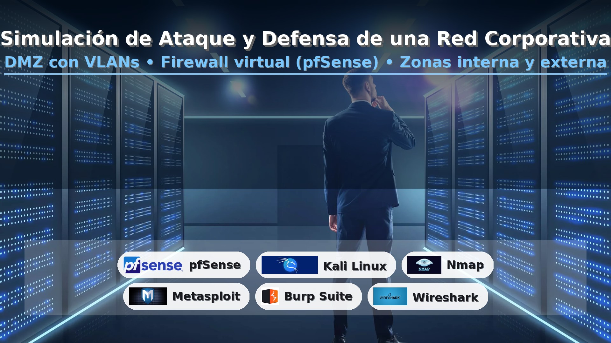

# Simulación de Ataque y Defensa de una Red Corporativa

## AWS + Terraform · DMZ · pfSense · Segmentación por zonas



Proyecto base para **replicar una red corporativa en AWS** usando **Terraform**.
La topología incluye **DMZ**, **firewall virtual (pfSense)** y **zonas segmentadas** para separar tráfico **externo, DMZ, interno y gestión**. Se realizaron **pruebas de validación de controles** (firewall, IDS y segmentación) para confirmar su efectividad ante escenarios de riesgo.

---

## 🧭 Objetivos

* Aprovisionar infraestructura reproducible de red en AWS con **IAC**.
* Implementar **segmentación** entre zonas y **políticas de filtrado**.
* Validar controles: **pfSense (firewall)**, **IDS** (p. ej., Suricata en pfSense) y **aislamiento** entre zonas.

---

## 🏗️ Arquitectura (resumen)

* **VPC única** con 3–4 subredes:

  * `public-dmz` (expuesta mediante IGW)
  * `private-int` (servicios internos)
  * `mgmt` (bastion/administración)
  * *(opcional)* `external/untrusted` (origen de pruebas)
* **pfSense** como **appliance** con **múltiples ENI** (WAN/DMZ/INT/MGMT).
* **Route Tables**: el tráfico Este–Oeste y Norte–Sur pasa por pfSense.
* **Security Groups / NACLs** de contención.
* **Kali Linux** (para pruebas), **Web en DMZ**, **App/DB en INT**.
* **IDS**: Suricata (pfSense) o sensor EC2 en espejo de tráfico.

> Nota: En AWS no se exponen VLANs 802.1Q de forma nativa; la **segmentación se emula** con **subnets + route tables + SG/NACLs**. El concepto de “VLAN” se usa aquí como dominio de broadcast **lógico**.

### Diagrama lógico (simplificado)

```
Internet
   │
[IGW]──(public-dmz)──[Web/Proxy]──┐
   │                               │
 [pfSense (WAN/DMZ/INT/MGMT)]──────┼──(private-int)──[App/DB]
   │                               │
   └────────────(mgmt)──[Bastion]──┘
(optional) (untrusted)──[Kali]
```

---

## 📁 Estructura del repo

```
.
├─ docs/
│  └─ portada.png
├─ terraform/
│  ├─ main.tf
│  ├─ variables.tf
│  ├─ outputs.tf
│  └─ modules/
│      ├─ vpc/
│      ├─ subnets/
│      ├─ pfsense/
│      └─ instances/
└─ tests/
   ├─ nmap-scenarios.md
   └─ ids-notes.md
```

---

## 🔧 Requisitos

* **AWS account** con credenciales configuradas (`aws configure`).
* **Terraform ≥ 1.5**
* Par de llaves EC2 (SSH) existente: `key_name`.
* AMIs disponibles para **pfSense** (Marketplace) y **Kali/Ubuntu**.

---

## ⚙️ Variables principales (ejemplo `terraform.tfvars`)

```hcl
project         = "corp-net-lab"
region          = "us-east-1"

vpc_cidr        = "10.50.0.0/16"
dmz_cidr        = "10.50.10.0/24"
int_cidr        = "10.50.20.0/24"
mgmt_cidr       = "10.50.30.0/24"
untrusted_cidr  = "10.50.40.0/24" # opcional

key_name        = "my-ssh-key"
pfsense_ami     = "ami-xxxxxxxx"  # pfSense en Marketplace
kali_ami        = "ami-yyyyyyyy"  # Kali/Ubuntu para pruebas

instance_type_pfsense = "t3.large"
instance_type_kali    = "t3.small"
```

---

## 🚀 Despliegue rápido

```bash
cd terraform
terraform init
terraform plan -var-file=../terraform.tfvars
terraform apply -var-file=../terraform.tfvars
```

**Salidas (outputs)** típicas:

* IP pública de pfSense (WAN)
* IP bastion (mgmt)
* IP del host Kali y Web DMZ
* Subnets y rutas creadas

---

## 🔐 Políticas base (pfSense + AWS)

* **DMZ** solo expone `80/443` desde Internet hacia `Web`.
* **INT** no es accesible desde Internet.
* **MGMT** solo SSH desde IPs de administración.
* **Egress** desde INT permitido solo a `80/443` vía pfSense (NAT).
* **IDS** (Suricata) activo en interfaces WAN/DMZ con reglas “balanced”.

---

## ✅ Validación de Controles (ejemplos)

> Conéctate al **host Kali** (subred `untrusted`) o al **bastion** (mgmt) y ejecuta:

### 1) Firewall de perímetro / DMZ

```bash
# Escaneo a Web (debe ver solo 80/443 abiertos)
nmap -sS -Pn <ip_web_dmz>
# Verificar bloqueo de SSH
nmap -p22 <ip_web_dmz>
```

### 2) Aislamiento de INT

```bash
# Desde Kali o Internet: INT debe estar inaccesible
nmap -sS -Pn <ip_app_int>         # esperado: filtrado/cerrado
```

### 3) Salida controlada desde INT

```bash
# En una instancia de INT:
curl -I https://example.org       # permitido 80/443
curl -I http://example.org:8080   # esperado: bloqueado por pfSense
```

### 4) IDS (Suricata)

```bash
# Genera tráfico sospechoso desde Kali a Web/DMZ
nmap -sS -p- --min-rate 5000 <ip_web_dmz>
# Revisa alertas en pfSense: Services ▸ Suricata ▸ Alerts
```

> Documenta capturas o logs en `tests/`.

---

## 💰 Costos y limpieza

Este laboratorio **genera costos** en AWS (EC2, EIP, almacenamiento).
Para **eliminar** todo:

```bash
cd terraform
terraform destroy -var-file=../terraform.tfvars
```

---

## 🛡️ Aviso ético

Uso **exclusivamente educativo**. No ejecutes pruebas sobre sistemas que no te pertenezcan o sin autorización explícita.

---

## 🗺️ Roadmap corto

* [ ] Módulo opcional de **WAF** delante de la Web de DMZ
* [ ] **Gateway Load Balancer** para encaminar tráfico a pfSense
* [ ] Pipelines CI para `terraform fmt/validate/plan`
* [ ] Dashboards de CloudWatch/Suricata

---

## 📜 Licencia

MIT. Atribuye si reutilizas parte del código o de la guía.
